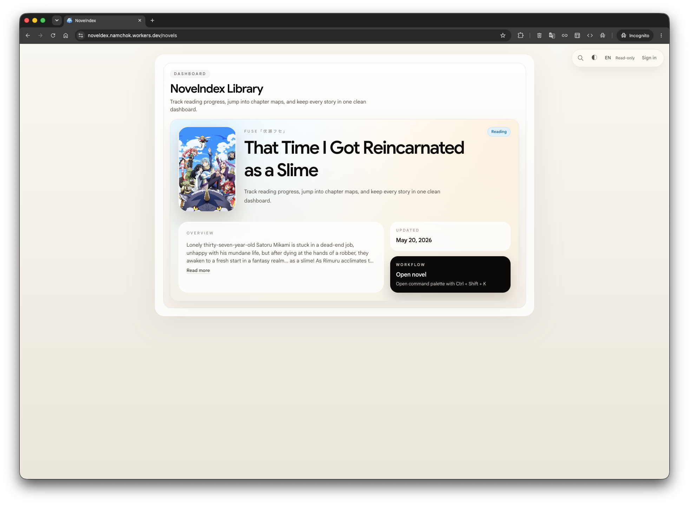
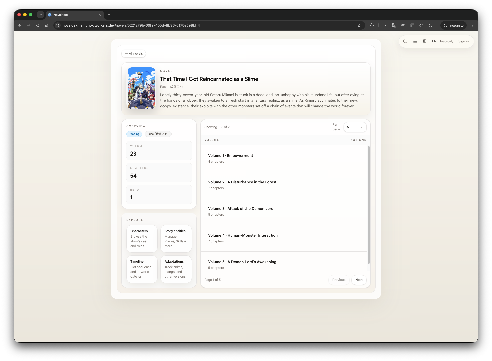
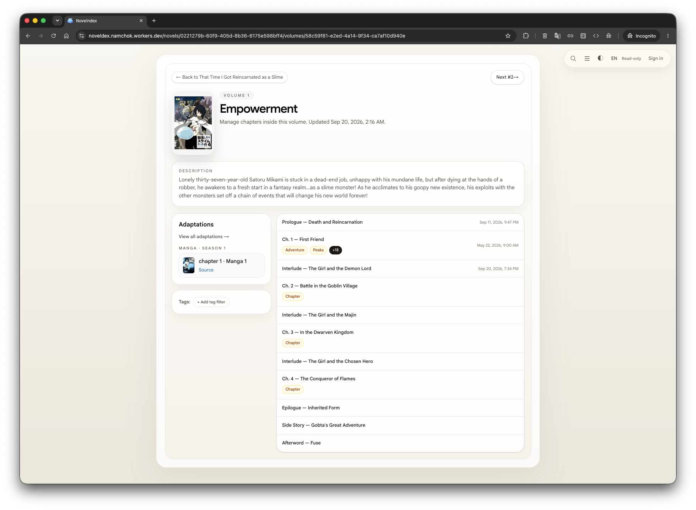
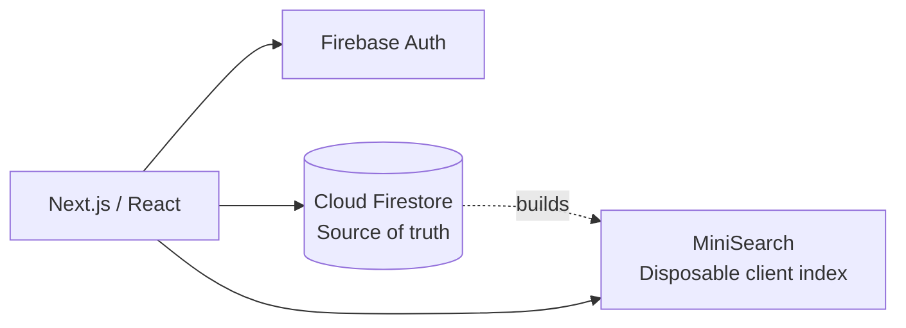

# Novelndex

[](https://nextjs.org/) [](https://react.dev/) [](https://www.typescriptlang.org/) [](https://firebase.google.com/) [](https://tailwindcss.com/) [](package.json)

A personal knowledge workspace for novels — notes, characters, timelines, and adaptations, all in one searchable place.

**Live demo:** [noveldex.namchok.workers.dev/novels](https://noveldex.namchok.workers.dev/novels)

> **Naming note:** The project was originally named **Noveldex** and is now **Novelndex**. Some legacy URLs, deployment names, and internal references may still use the former name.

Browse as guest, read-only. Sign in to edit.



## What it does

Novelndex organizes a novel's world as you read or write it:

- Novels, volumes, and chapters
- Timestamped notes with `[[entity]]` references
- Characters, locations, skills, organizations, items, and concepts
- Story-order timeline events
- Anime/manga/movie adaptation tracking, mapped back to source chapters
- Fast client-side search across all of it

## Preview

preview-library


preview-chapter


## Features

### Reading & Structure

- Novels → volumes → chapters
- Prologue, epilogue, side story, and custom chapter entries
- Reading order independent from chapter numbering

### Notes & References

- Timestamped chapter notes
- `[[Name]]` and `[[type:Name]]` entity references (character, location, skill, organization, item, concept)
- Tags

### Characters

- Role-filtered directory with prefix search and sortable profiles
- Rich appearance, personality, trivia, and grouped character facts
- Visual galleries with external image sources, categories, and ordering

### Search

- Client-side full-text search (MiniSearch), no server round trip
- Global, novel, volume, and chapter scopes
- Entity-aware: characters, locations, skills, organizations, items, concepts

### Story Timeline

- Story-order timeline (volume → chapter → page → event)
- Character links on events

### Adaptations

- Anime, manga, movies, and other media
- Adaptation notes and links back to source chapters

### Access

- Guest: read-only
- Signed-in user: full editing

## Tech Stack

| Area           | Technology                       |
| -------------- | -------------------------------- |
| App            | Next.js 16, React 19, TypeScript |
| UI             | Tailwind CSS 4                   |
| Data           | Cloud Firestore                  |
| Authentication | Firebase Auth                    |
| Search         | MiniSearch (client-side)         |
| Deployment     | Cloudflare Workers (via Vinext)  |
| Testing        | Vitest                           |

## Architecture

Novelndex is a client-first application:



- Firestore is the source of truth
- Search index is derived and disposable, rebuilt each session
- No application API server in the active runtime path
- PostgreSQL is retained only as legacy backup/recovery material, not a live datastore

Full schema and rationale: [`docs/engineering/DECISIONS.md`](docs/engineering/DECISIONS.md).

## Getting Started

Requirements: Node.js 22+, Corepack.

```bash
corepack pnpm install
corepack pnpm dev
corepack pnpm lint
corepack pnpm test
```

Open [http://localhost:3000](http://localhost:3000).

Copy `.env.local.example` to `.env.local` and set Firebase browser config. Set `NEXT_PUBLIC_FIREBASE_USE_EMULATOR=1` to run against local Firestore/Auth emulators:

```bash
corepack pnpm emulators
```

Create a user in the Auth emulator UI ([http://127.0.0.1:4000/auth](http://127.0.0.1:4000/auth)) to sign in and test editing.

## Project Status

Actively developed. Core notes, search, timeline, and auth features are live.

- **Current focus:** cross-reference views, adaptation comparison (LN volume ↔ anime episode / manga chapter)
- **Deferred:** import/export, backup tooling, reading/watching progress tracking

## Documentation

- [Current project context](docs/ai/CONTEXT.md)
- [Architecture decisions](docs/engineering/DECISIONS.md)
- [Progress and backlog](docs/engineering/PROGRESS.md)
- [Cloudflare Workers deployment](docs/engineering/cloudflare-workers.md)

## Contributors

Novelndex is maintained by its human contributors with assistance from AI coding tools, including OpenAI Codex and Anthropic Claude.

AI tools may support research, implementation, testing, and documentation. Human contributors review and approve changes and remain responsible for project decisions, code quality, and releases.

## License

[MIT](LICENSE)

---

© 2026 _Namchok Singhachai_. Novelndex is released under the MIT License.
